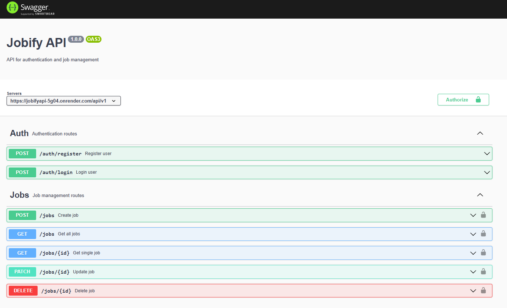

#### Project Setup

To run the project, in the root create a .env file and add these two variables, with your own values.

MONGO_URI
JWT_SECRET

Then run this command

```bash
npm install && npm start
```

#### Endpoints

#### Swagger screenshot

<p align="center">
  
</p>
